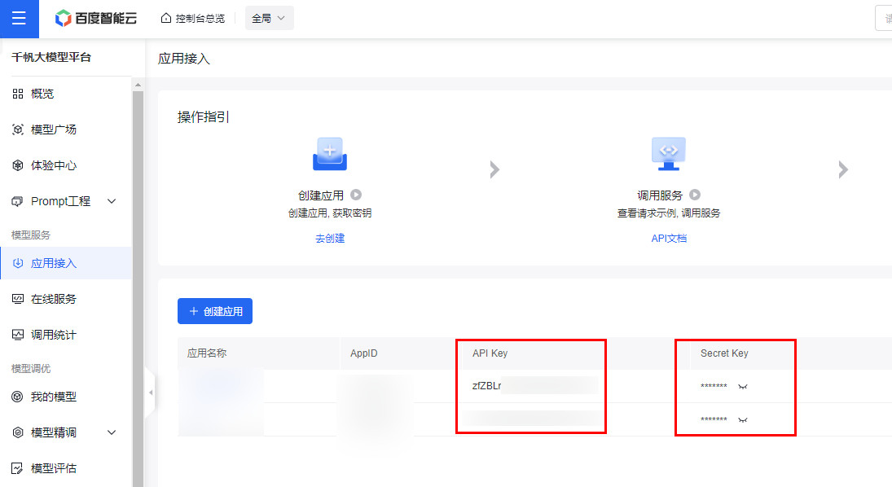

# Pot-App 百度文心ERNIE免费模型 翻译插件

## 介绍
1. 使用百度云文心系列模型中的免费模型进行翻译：ernie_speed/ernie-speed-128k/ernie-lite-8k
2. ernie_speed和ernie-lite-8k个人免费版限速：每分钟最多300次请求，每分钟最多使用词元数：300K；ernie-speed-128k个人免费版限速：每分钟最多60次请求，每分钟最多使用词元数：300K. 不保障SLA，这个限制速度是足够个人使用的。
3. 你可以自定义几乎所有的配置项，包括系统人设、提示词、采样温度、Top-P、惩罚因子等。
4. 由于Pot的插件不支持打印机流式效果，所以只支持获取到所有翻译内容后再一并显示。

## 配置参数

### 获取API Key和Secret Key

1. 注册百度智能云
2. 实名认证
3. 进入千帆大模型平台，在模型服务里应用接入页面创建应用
4. 随便编辑应用名和描述，服务保持默认选择所有预置应用即可
5. 保存后回到应用列表里，即可复制对应应用API Key和Secret Key，见下图
6. 开通免费模型的后付费服务



### 必填配置项
1. API Key: 上面获取到的
2. Secret Key：上面获取到的
3. 选用模型：ernie_speed/ernie-speed-128k/ernie-lite-8k，推荐ernie-lite-8k，翻译质量好一些

### 可选配置项
1. System人设：系统人设提示词字符串, 留空时默认为`You are a professional translation engine.`
2. 翻译提示词：用户自定义提示词列表, 由一行json字符串表示, 列表中元素值中的role有两种：user: 表示用户；assistant: 表示对话助手, content表示内容。content中的`$to$`会自动替换为译文语言描述, 例如`Traditional Chinese(繁體中文)`, `$src_text$`会自动被替换为原文文本。 如果留空则使用默认提示词（你可以在 json.cn 上编辑该提示词，之后压缩为一行即可导入程序）：

    >`[{"role":"user","content":"You are a professional translation engine, skilled in translating text into accurate, professional, fluent, and natural translations, avoiding mechanical literal translations like machine translation. You only translate the text without interpreting it. You only respond with the translated text and do not include any additional content."},{"role":"assistant","content":"OK, I will only translate the text content you provided, never interpret it."},{"role":"user","content":"Translate the text delimited by ``` below to Simplified Chinese(简体中文), only return translation:\n```\nHello, world!\n```\n"},{"role":"assistant","content":"你好，世界！"},{"role":"user","content":"Translate the text delimited by ``` below to English, only return translation:\n```\n再见，小明\n```\n"},{"role":"assistant","content":"Bye, Xiaoming."},{"role":"user","content":"Translate the text delimited by ``` below to $to$, only return translation:\n```\n$src_text$\n```\n"}`

3. temperature：留空时默认0.6, 范围 (0, 1.0], 不能为0, 值越小, 生成的内容越固定
4. top_p：留空时默认为0.9, 取值范围：[0.0, 1.0], 值越大, 生成的内容多样性越丰富
5. penalty_score：留空时默认为1.0, 取值范围：[1.0, 2.0], 值越大, 生成的内容重复性的内容越少
6. 自定义请求地址：留空时默认为`https://aip.baidubce.com/rpc/2.0/ai_custom/v1/wenxinworkshop/chat/`，实际请求地址为自定义请求地址+选用模型名

## 插件不足

当前鉴权机制是每次请求均请求一次access_token，access_token有效期是一个月，所以新请求没必要再次刷新access_token。但是因为不知道pot插件里应该怎么弄access_token的缓存，个人也不懂Rust，所以没有缓存access_token。代码都是大模型写的。有知道的朋友欢迎提出建议或PR。

